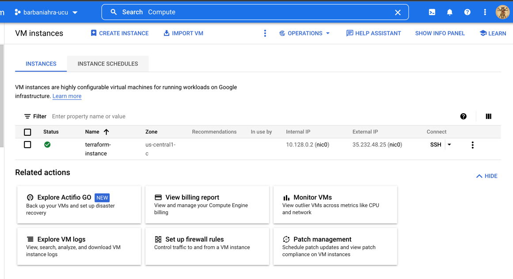

1) Created VPC network:
```
 ...
google_compute_network.vpc_network: Creating...
google_compute_network.vpc_network: Still creating... [10s elapsed]
google_compute_network.vpc_network: Still creating... [20s elapsed]
google_compute_network.vpc_network: Creation complete after 27s [id=projects/barbaniahra-ucu/global/networks/terraform-network]

Apply complete! Resources: 1 added, 0 changed, 0 destroyed.
```


2) Created compute instance:


